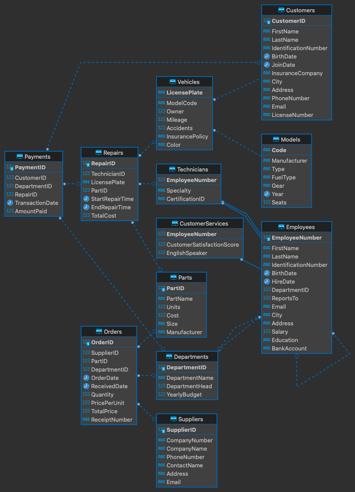

# Wheely Good Repairs
Car repair shop database, made for Azure SQL Edge Server.

### Steps
* Step 1: Create database and tables
* Step 2: Insert data
* Step 3: Query the database

### Helpers
* Makefile for CLI formatting and creating a database container.